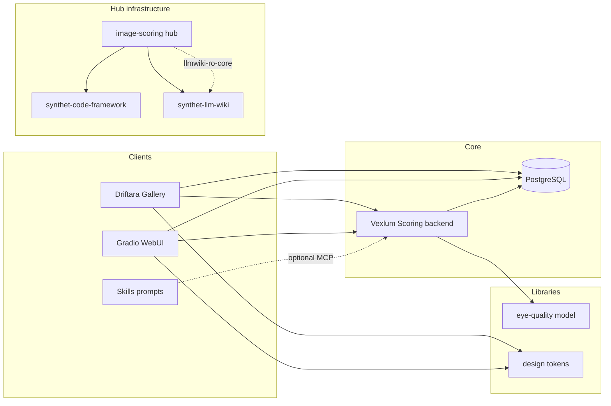

# Ecosystem map

High-level relationships between sibling repos. Detailed architecture remains in each product repo.

## Data and config

- **Primary store:** PostgreSQL in backend deployments (`database.engine`: `postgres` or `api`).
- **Machine paths:** `environment.json` (gitignored) overrides `config.json` per repo.
- **Scores:** Normalized model outputs in backend DB; skills repo can read via MCP (`imgscore-db`) — separate from editorial 1–10 rubric.

## Integration points

| From | To | Mechanism |
|------|-----|-----------|
| Gallery | Backend | REST API / SQL mode; sibling folder for default port discovery |
| Backend | Model | `pip install -e ../image-scoring-model`; phase `eye_quality` (see model `BACKEND_INTEGRATION.md`) |
| Backend SPA, Gallery | UI package | `file:../image-scoring-ui` or GitHub tag dependency |
| Skills | Backend | Sibling path + `.cursor/mcp.json` stdio or SSE |

## Canonical sources

Do not fork long guides into this hub. Prefer:

- Backend: `docs/README.md`, `docs/features/implemented/INDEX.md`
- Gallery: `docs/README.md`, `docs/features/implemented/INDEX.md`
- Model: `docs/CANONICAL_SOURCES.md`
